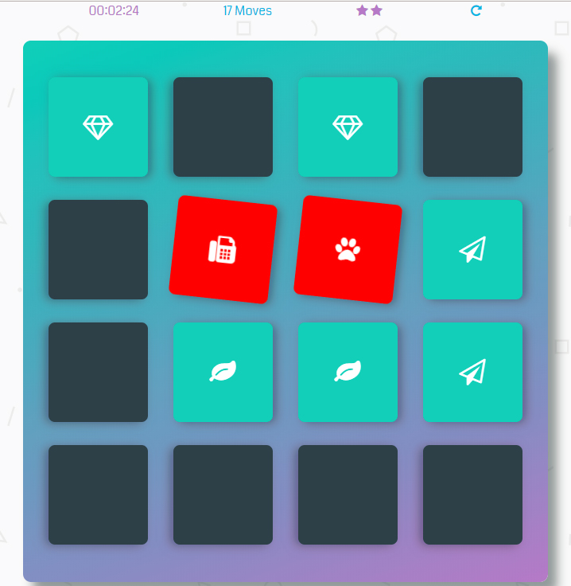

# Matching Game

This is one of my assignments @Udacity. _JavaScript_ is used in this project.

## Table of Contents

* [Instructions](#instructions)
* [Contributing](#contributing)

## Instructions

The **gameplay rules** are very simple:

flip over two hidden cards at a time to locate the ones that match!

### How The Game Works
Each turn:

1. The player flips one card over to reveal its underlying symbol.
2. The player then turns over a second card, trying to find the corresponding card with the same symbol.
3. If the cards match, both cards stay flipped over.
4. If the cards do not match, both cards are flipped face down.

The game ends once all cards have been correctly matched.

### Flip One card

### A Correct Guess

### An Incorrect Guess

## Contributing

This repository is just one of my assignments @Udacity. Therefore, I most likely could not accept pull requests.
